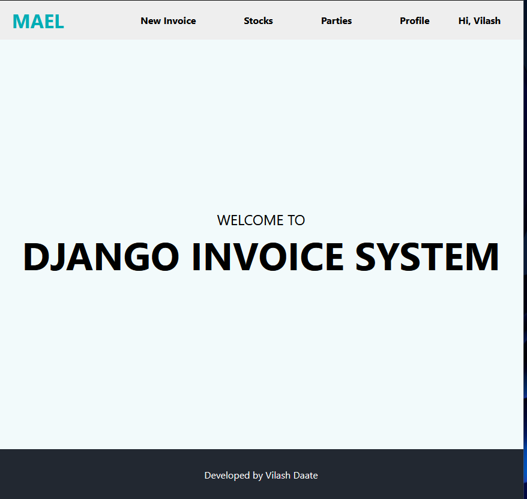
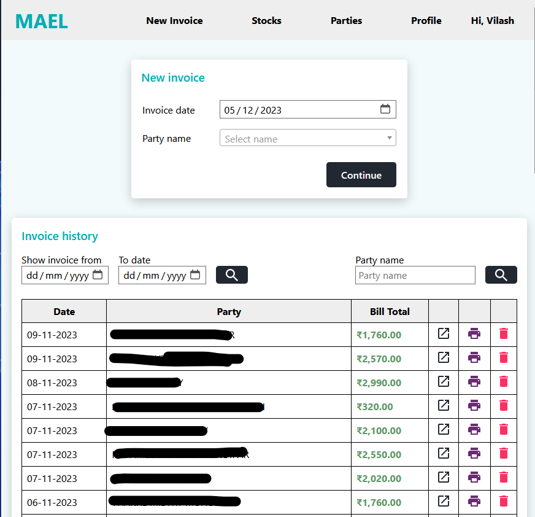
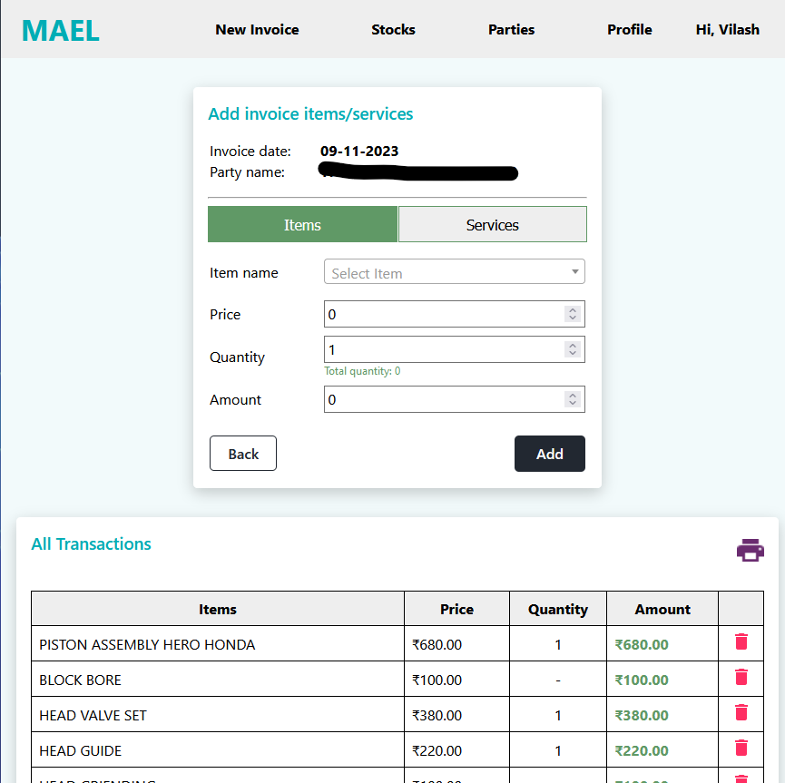
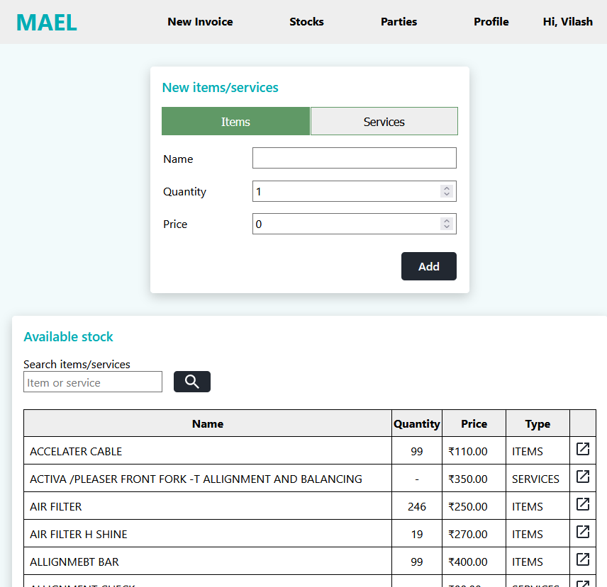
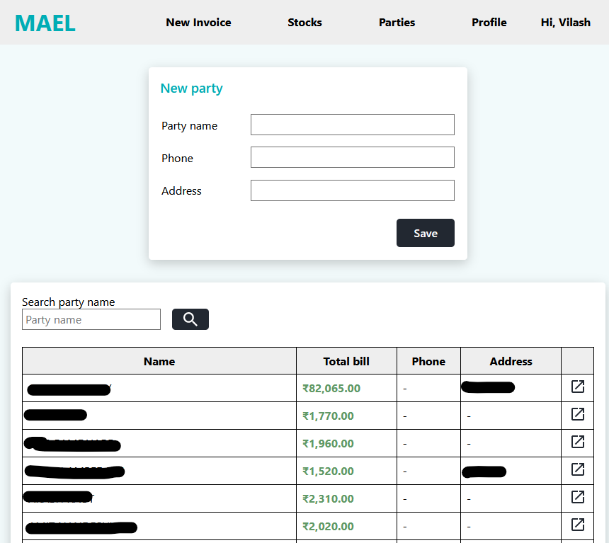
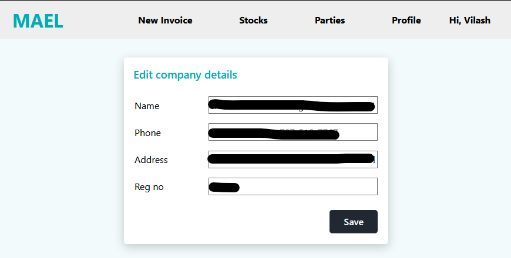
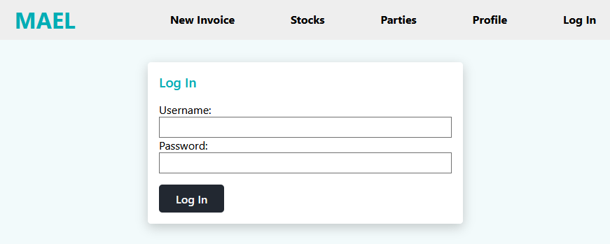

# Django Shop Invoice Management

Django-based shop invoice system provides a comprehensive set of features for managing invoices, items, parties, and shop profile details while maintaining a secure authentication system.

## Installation
1. Clone the Repo
```bash
git clone https://github.com/vilash99/shop_django.git
```

2. Setup virtual environment & Install Requirements

```bash
python -m venv .venv
.venv/Scripts/activate
pip install -r requirements.txt
```
3. Migrate Database and create superuser

```bash
python manage.py migrate
python manage.py createsuperuser
```
4. Make app migration
```bash
python manage.py makemigrations
python manage.py migrate
```
Then go to the browser and enter the url **http://127.0.0.1:8000/**




## 1. Create a new invoice and add items to this invoice:
It has functionality to create new invoices. This involves capturing essential details such as invoice number, date, and associated party (customer). Users can then add items to the invoice, specifying item details such as name, quantity, and unit price. The system should accurately calculate the total amount for the invoice based on the added items.



## 2. Edit old invoices or delete old invoices:
Users have the ability to edit existing invoices, allowing them to modify details such as the invoice date, associated party, or individual item details. Additionally, your system supports the deletion of old invoices when necessary.



## 3. Create new items in stocks, as well as have the option to edit and delete them:
The system includes functionality to manage inventory by allowing users to create new items. Users can specify details such as item name, initial quantity in stock, and unit price. The system also supports the editing and deletion of existing items, enabling efficient inventory management.



## 4. Create, update, and invoice party:
It includes features for managing customer information. Users can create new party records (customers), providing details such as party name, contact number, and address. Additionally, users can update existing party records to reflect any changes in customer information.



## 5. Update shop profile details:
The system allows users to update shop profile details, ensuring that the information presented to customers is accurate and up-to-date. This could include details such as the shop name, address, contact information.



## 6. It also supports login and logout features:
It has user authentication features. Users can securely log in to access the system's functionalities and log out when the session is complete. This ensures that only authorized users can perform operations on the shop invoice system.




## Contributors

We welcome and greatly appreciate contributions! Every small contribution makes a significant impact, and proper credit will be attributed.

Don't hesitate to **star** the repository and feel free to submit **pull** requests. Your involvement is valued!

## Contact
Visit my website: https://vilashdaate.com/

Visit my blog: https://www.kushalstudy.com/

Contact me: contact@vilashdaate.com